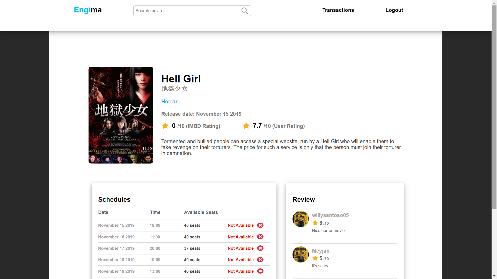
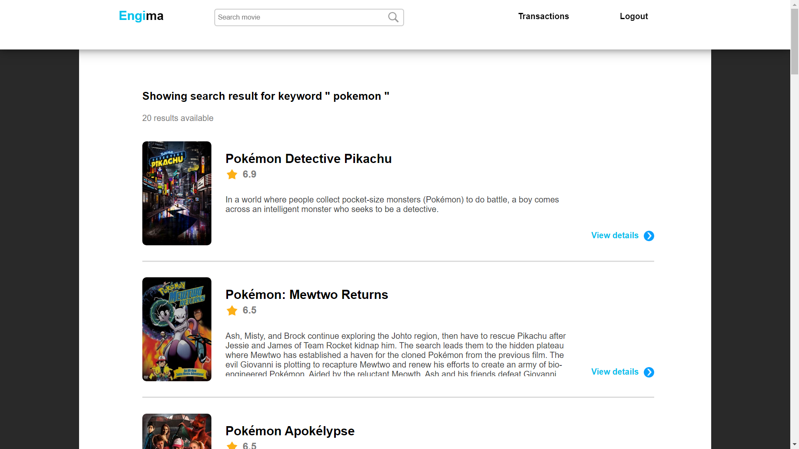
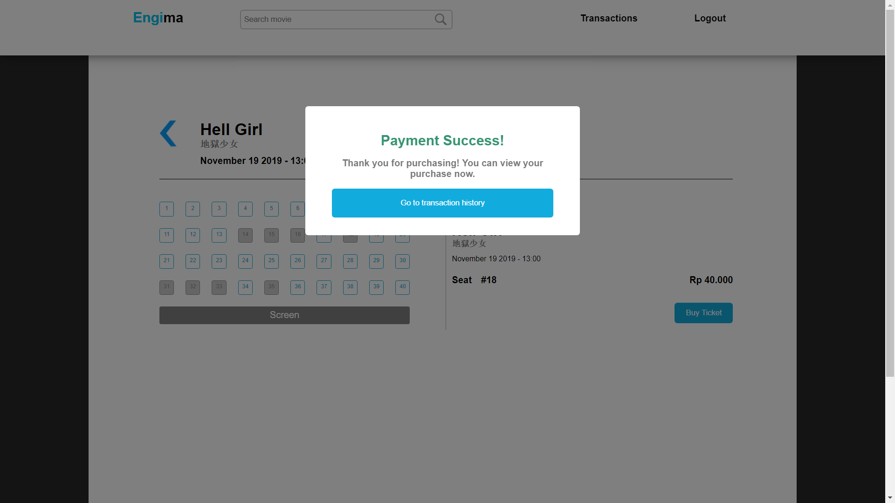
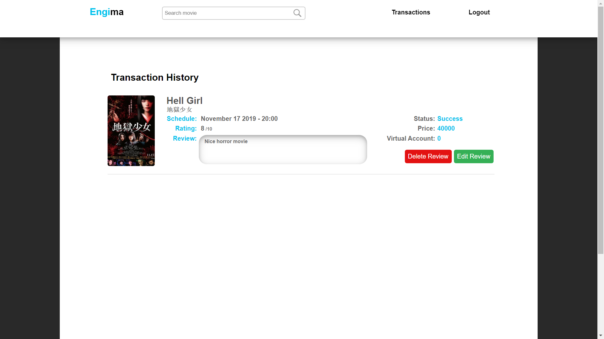

<h1 align="center">
    <b>
        <br>
        # Tugas Besar 2 IF3110 Pengembangan Aplikasi Berbasis Web / IF3159 Dasar Pembangunan Perangakat Lunak
        <br>
    </b>
</h1>

<h2 align="center">
    <b>
        <br>
        Engi's Cinema Remake
        <br>
        <br>
    </b>
</h2>

## Deskripsi Singkat

Setelah aplikasi web Engima diluncurkan, bioskop Engi menjadi sangat laku. Sebelumnya, Engi mengurus semua transaksi tiket film dan penambahan data film secara manual. Karena kewalahan, akhirnya Engi pergi ke seorang konsultan IT untuk menemukan solusi dari permasalahannya. Konsultan menyarankan Engi untuk menggunakan web service untuk mempermudah pekerjaannya. Melihat aplikasi web yang sudah dibuat memuaskan, Engi ingin mengimplementasikan perubahan tersebut beserta web service dan aplikasi Bank yang digunakan untuk transaksi tiket film di Engima.

Website ini dibuat dengan menggunakan Javascript, HTML dan CSS untuk frontend dan menggunakan bahasa PHP untuk backend. Aplikasi Bank dibuat dengan menggunakan ReactJS. Web Service Bank dibuat di atas java servlet dengan menggunakan JAX-WS dengan protokol SOAP. Web Service Transaksi dibuat di atas java servlet dengan menggunakan Node.js dengan protokol REST. Serta MySQL untuk penyimpanan data pada basis data (data film yang ditampilkan dari API TheMovieDB).

<br>

## Requirement
| Nomor | Requirement                | Penjelasan                                                             |
|:-----:|:---------------------------|:-----------------------------------------------------------------------|
| 1.    | Browser (support html 2.0) | Dibutuhkan sebagai sarana utama menjalankan frontend Engima            |
| 2.    | Koneksi Internet           | Dibutuhkan untuk mendapatkan data dari TheMovieDB API                  |
| 3.    | PHP                        | Dibutuhkan untuk menjalankan program backend engima                    |
| 4.    | Web service bank pro       | Dibutuhkan untuk menambahkan akun bank saat registrasi dan mendapatkan status transaksi pengguna                                                                                     |
| 5.    | Web service transaksi      | Dibutuhkan untuk mendapatkan data transaksi pengguna                   |
| 6.    | XAMPP                      | Dibutuhkan untuk menjalankan database MySQL dan web services           |

<br>

## Cara Instalasi
1. Download/Clone Engima dari git pada folder engi_cinema
2. Pastikan posisi folder engi_cinema berada pada path ..\xampp\htdocs\
3. Jalankan modul Apache dan MySQL pada XAMPP
4. Jalankan http://localhost/engi_cinema/ pada browser pilihan

<br>

## Cara Menjalankan Server

Cara menjalankan:

| local                                                         |
|:-------------------------------------------------------------:|
| Jalankan modul Apache dan MySQL pada XAMPP                    |
| Pastikan folder engi_cinema berada pada path ..\xampp\htdocs\ |
<br>

| AWS EC2                                                        |
|:--------------------------------------------------------------:|
| ketikan ```http://3.83.91.13/engi-s-cinema``` pada web browser |
<br>

<br>

## Perubahan Basis Data Engima

| Number | Relasi               | Status          |
|:------:|:---------------------|:----------------|
| 1.     | movies               | Deleted         |
| 2.     | schedule             | Deleted         |
| 3.     | seat                 | Deleted         |
| 4.     | showing              | Deleted         |
| 6.     | transactions_history | Deleted         |
| 7.     | users                | + accountNumber |

<br>

## Screenshots Perubahan Tampilan Engima

### Film Detail

<br>
<br>

<br>
<br>

### Homepage

<br>
<br>

### Register

<br>
<br>

### Review

<br>
<br>

<br>
<br>

### Search

<br>
<br>

<br>
<br>

### Buy Ticket

<br>
<br>

<br>
<br>

<br>
<br>

<br>
<br>

<br>
<br>

<br>
<br>

### Transactions History

<br>
<br>

<br>
<br>

<br>
<br>

<br>

## Keterangan Tambahan

* Jam pada aplikasi web mengacu pada jam lokal pengguna.
* Waktu transaksi yang digunakan adalah waktu lokal.
* Basis data menggunakan MySQL.

<br>

## Knowledge

Beberapa teknik yang digunakan pada pengerjaan tugas kali ini

|              | Kata Kunci                                                                         |
| ------------ | ---------------------------------------------------------------------------------- |
| HTTP methods | get, post, put, delete, response, onload, onreadystatechange                       |
| CSS          | margin, padding, font-size, text-align, flex, grid, border, color, div, span       |
| Javascript   | XMLHTTPRequest, addEventListener, FormData, createElement, appendChild, parentNode |
| PHP          | PDO, $_GET, $_POST, $_COOKIE, var_dump, print_r, echo, require, fungsi header      |
| SQL query    | SELECT, INSERT, UPDATE, DELETE, WHERE, operator LIKE                               |

<br>

## Pembagian Tugas

### REST
| Number | Feature                        | Assignment |
|:------:|:-------------------------------|:-----------|
| 1.     | Database configuration         | 13517137   |
| 2.     | Get all transactions           | 13517137   |
| 3.     | Get user transactions          | 13517137   |
| 4.     | Add transaction                | 13517137   |
| 5.     | Update transaction status      | 13517137   |
| 6.     | Delete transaction             | 13517137   |
| 7.     | Default response configuration | 13517137   |
| 8.     | REST server configuration      | 13517137   |

### SOAP
| Number | Feature                                   | Assignment |
|:------:|:------------------------------------------|:-----------|
| 1.     | Login service                             | 13517137   |
| 2.     | Register service                          | 13517137   |
| 3.     | Add balance service                       | 13517137   |
| 4.     | Get account number service                | 13517137   |
| 5.     | Get customer balance service              | 13517137   |
| 6.     | Transfer service                          | 13517137   |
| 7.     | Get customer transactions history service | 13517137   |
| 8.     | Get virtual number service                | 13517137   |
| 9.     | Check transactions service                | 13517137   |

### ReactJS
| Number | Feature                   | Assignment |
|:------:|:--------------------------|:-----------|
| 1.     | Title page                | 13517137   |
| 2.     | Login page                | 13517137   |
| 3.     | Transfer page             | 13517137   |
| 4.     | Add balance page          | 13517137   |
| 5.     | Transactions history page | 13517137   |
| 5.     | Logout function           | 13517137   |

### Perubahan Engima
| Number | Feature                                 | Assignment |
|:------:|:----------------------------------------|:-----------|
| 1.     | Login                                   | 13517137   |
| 2.     | Register                                | 13517137   |
| 3.     | Homepage                                | 13517137   |
| 4.     | Movies Detail                           | 13517137   |
| 5.     | Review                                  | 13517137   |
| 6.     | Search                                  | 13517137   |
| 7.     | Transactions History                    | 13517137   |
| 8.     | Ticket                                  | 13517137   |
| 9.     | Connecting to TheMovieDB API            | 13517137   |
| 10.    | Connecting to transactions web services | 13517137   |
| 11.    | Connecting to bank pro web services     | 13517137   |

### README Engis Cinema
| Number | Feature     | Assignment |
|:------:|:------------|:-----------|
| 1.     | Deskripsi   | 13517137   |
| 2.     | Screenshots | 13517137   |

### README Bank Pro
| Number | Feature     | Assignment |
|:------:|:------------|:-----------|
| 1.     | Deskripsi   | 13517137   |
| 2.     | Screenshots | 13517137   |

### README WS-Transaksi
| Number | Feature                | Assignment |
|:------:|:-----------------------|:-----------|
| 1.     | Deskripsi              | 13517137   |
| 2.     | Basis Data Web Service | 13517137   |

### README WS-Bank
| Number | Feature                | Assignment |
|:------:|:-----------------------|:-----------|
| 1.     | Deskripsi              | 13517137   |
| 2.     | Basis Data Web Service | 13517137   |

### CI/CD
| Number | Feature                | Assignment |
|:------:|:-----------------------|:-----------|
| 1.     | Linting                | 13517137   |
| 2.     | Deployment to AWS EC2  | 13517137   |

### Special Thanks To
| Nama                           | NIM      |
|:-------------------------------|:--------:|
| Lukas Kurnia Jonathan          | 13517006 |
| Johannes                       | 13517012 |
| Yoel Susanto                   | 13517014 |
| T. Antra Oksidian Tafly        | 13517020 |
| Steve Andreas Immanuel         | 13517039 |
| Ariel Ansa Razumardi           | 13517040 |
| Nixon Andhika                  | 13517059 |
| Joshua Christo Randiny         | 13517063 |
| Willy Santoso                  | 13517066 |
| Rayza Mahendra Guntara Harsono | 13517073 |
| Edward Alexander Jaya          | 13517115 |
| Ferdy Santoso                  | 13517116 |
| Jan Meyer Saragih              | 13517131 |


<p align="center">
    <b>
        <br>
        <font size="6">
            About
        </font>
    </b>
</p>

<p align="center">
    <b>
        IF3110-Pengembangan Aplikasi Berbasis Web - 2019
        <br>
        Teknik Informatika 2017
        <br>
        <br>
        13517137 - Vincent Budianto
    </b>
</p>